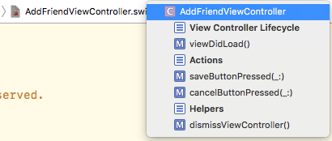

# Advanced Topics in iOS & Swift (Q2)

## Working with this Github repository

This repository is the _master_ repository which will contain all the course materials. That includes **slides, coding challenges and starter code** for larger projects.

Note that you **can not commit to this repository**! However, you can still and go **maintain your own version** of it. In that case, this is what the whole setup looks like:

Here are the steps that you need to perform to setup this infrastructure:

1. clone the repository:
`git clone https://github.com/MakeSchool-18/iOS-MVC`

2. create your own repository **on your Github account** named: `iOS-MVC`

3. add this repository as a _remote_ to the local one (note: you need to give a name to the _remote_, e.g. your first name):
`git remote add <first-name> https://github.com/<github-user>/iOS-MVC.git`

4. push the repo to the newly created remote:
`git push -u <first-name> master`

5. when you want to access new materials now, all you need to do is:
`git pull origin master`

6. when you worked on a challenge or a starter project, you can push it to your own remote repository with:
`git push`

## Code formatting rules for this class:

You should get into habit of writing your code so that it's readable for other people (and for you!). An important factor for this is **formatting**. Here are some guidelines that you should try to apply in order to make your code more readable:

1. Structure your code into _sections_, each section should have a title that you can insert in Xcode using `// MARK:`
2. Methods in a class should be separated with one line break in between them
3. Use two line breaks before starting a new section (this is the **only time where using more than one line break is allowed!**)
4. Generally, line breaks should be used with great care! Make sure to only use line breaks when you want make it clear that a certain code chunk (_paragraph_) bundles similar functionality (in these cases, it is often a good idea to put a comment on top the paragraph that shortly describes what the functionality of this paragraph is)
5. Use expressive variable and function names (no `var foo`, `var blaaa`, `var xxxx`)
6. For debugging with `print` statements, use an indication of where the print statement happened:
  - `#function` prints the name of the function that contains the `print` statement
  - `#file` gives you the name of the file that contains the `print` statement
  - `#line` gives you the line inside the file that contains the `print` statement
  - An example for a good print statement could be: `print(#file, #line, #function)`. Sometimes it is helpful to include some context as well, so if there are variables that you need to inspect, just append them to the statement: `print(#file, #line, #function, userName, accountInfo)`
7. Remove boilerplate code from your files that doesn't do anything for you. For example, when you create a new `UIViewController` subclass, there is usually some predefined boilerplate code generated for you. Apple means well, but if you don't use this code you should delete it. Examples for this are `didReceiveMemoryWarning()` or the commented version of  `prepare(for segue: UIStoryboardSegue, sender: Any?)`, even `viewDidLoad()` if you don't end up using it. 

#### Example

    class AddFriendViewController: UIViewController {
      
      // MARK: View Controller Lifecycle
      
      override func viewDidLoad() {
        super.viewDidLoad()
      }
      
      
      // MARK: Actions
      
      @IBAction func saveButtonPressed(_ sender: AnyObject) {
        dismissViewController()
      }
      
      @IBAction func cancelButtonPressed(_ sender: AnyObject) {
        dismissViewController()
      }
      
      
      // MARK: Helpers
      
      func dismissViewController() {
        presentingViewController?.dismiss(animated: true)
      }
      
    }

Here are two benefits that you get from this approach:

- You can now use the keyboard shortcut `cmd` + `alt` + `shift` + `←` to collapse all methods and get a nice overview of the code

- You can now use the "quick viewer" in Xcode to see the whole content of your file nicely organized

